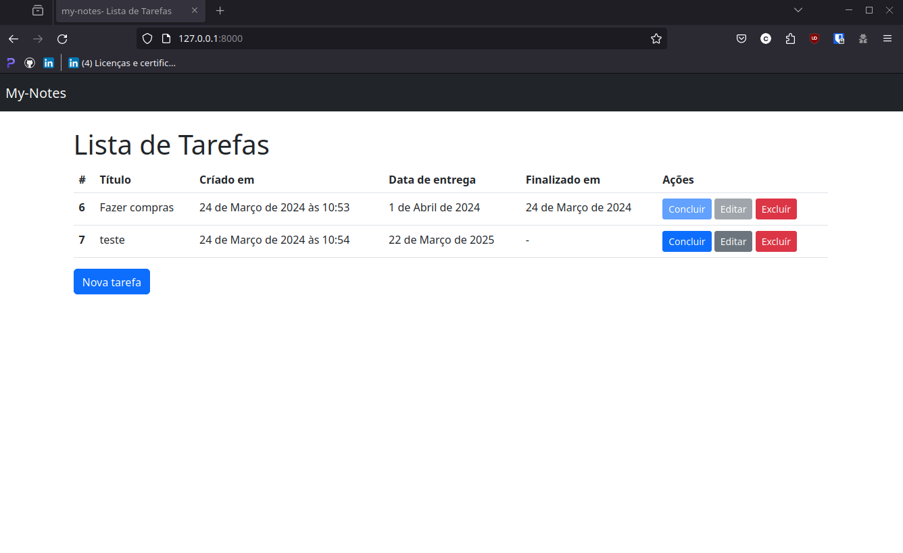

# django-task-list
Uma aplicação web Django para gerenciar e acompanhar tarefas diárias. Esta aplicação permite aos usuários adicionar, editar e excluir tarefas facilmente. Desenvolvido usando Django, Bootstrap, HTML e CSS. 

